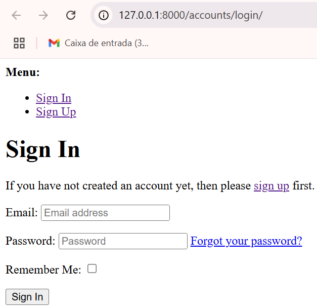

# CYCLEFIX ACADEMY - Bicycle Mechanics Courses E-commerce

---

## 📑 Table of Contents

1. [Planning](#planning)  
   -[General planning](#general-planning)  
   -[User stories](#user-stories)  
   -[MVP](#mvp)  
2. [Bugs](#bugs)  

## Planning  
[▲ Back to Top](#-table-of-contents)

### General Planning

1. Application Type

**Type:** E-commerce platform for selling digital products (online courses)  
**Business Model:** Business-to-Consumer (B2C)  
**Payment Model:** Single-payment per course (no subscriptions)  
**Niche:** Courses aimed at bicycle mechanics, from hobbyists to professional technicians

---

2. Core Features

**User Authentication & Profiles**
- Account creation with name, email, and password  
- Login/Logout functionality  
- Profile page with purchased courses and access history  

**Course Catalog**
- Display of all available bicycle mechanic courses with:
  - Title and description  
  - Price  
  - Category (e.g., Basic Maintenance, Advanced Repairs, Electric Bikes)  
  - Difficulty level (Beginner, Intermediate, Advanced)  
  - Estimated course duration (hours or modules)  
  - Preview video or sample lesson (optional)  
- Search and filter functionality by category, level, or price

**Shopping Cart and Checkout**
- Add single or multiple courses to the cart  
- Single-payment checkout with credit card, PayPal, or other gateways  
- Instant payment confirmation and order summary

**Student Dashboard (Course Access Area)**
- Access to purchased courses immediately after payment  
- Video player or embedded lessons  
- Downloadable resources such as PDFs, checklists, or maintenance guides  
- Progress tracking (optional for a better learning experience)

**Course Reviews and Ratings**
- Students can leave feedback after completing a course  
- Display of average ratings to build trust for new buyers

**Notifications and Emails**
- Order confirmation email  
- Course access instructions  
- Optional marketing emails for new course launches

---

3. Database Structure Overview

The application is built on a **relational database** that follows Django ORM conventions.  
The schema is designed to ensure **clear relationships** between entities and **support all CRUD operations** efficiently.

**Users**
- `user_id` (PK)  
- `full_name`  
- `email` (unique)  
- `password_hash`  
- `date_joined`  

**Courses** *(Digital Products)*  
- `course_id` (PK)  
- `title`  
- `description`  
- `price`  
- `thumbnail_image`  
- `category` *(Basic, Advanced, Electric Bikes, etc.)*  
- `difficulty_level` *(Beginner, Intermediate, Advanced)*  
- `duration` *(hours or modules)*  
- `average_rating`  

**Orders**
- `order_id` (PK)  
- `user_id` (FK → Users)  
- `order_date`  
- `total_amount`  
- `payment_status` *(Paid / Pending / Failed)*  

**Order Items**
- `order_item_id` (PK)  
- `order_id` (FK → Orders)  
- `course_id` (FK → Courses)  
- `quantity` *(default = 1)*  

**Course Access**
- `access_id` (PK)  
- `user_id` (FK → Users)  
- `course_id` (FK → Courses)  
- `purchase_date`  
- `progress` *(optional, percentage completed)*  

> **Note:** This structure ensures:
> - A clear separation between orders and the courses purchased.  
> - The ability to store and retrieve purchase history per user.  
> - Flexibility for adding progress tracking or course updates in the future.  

---

4. Design & Business Considerations
This project is designed for **digital-only products** (no physical shipping or stock control).  
The primary focus is on **delivering a smooth, secure, and mobile-friendly purchasing experience** for a B2C audience.

**Key Considerations**
- **Frictionless Checkout** – Single-payment model with minimal steps between product selection and payment confirmation.  
- **Responsive Design** – Mobile-first layouts to support users who may access the platform from workshops or on-the-go.  
- **SEO & Marketing Readiness** – Clear metadata, search-friendly structure, and social media integration to reach target audiences.  
- **Digital Product Delivery** – Immediate access to courses after payment, with secure video hosting and downloadable resources.  
- **Scalability** – Database and structure prepared to support more courses, categories, and future features like progress tracking or certifications.  

---

### **User Stories**

This document describes the **User Stories** for the product, organized by **epics**.  
Format:  
**As a** [user type] **I want** [action] **so that** [benefit].

- **Priority (MoSCoW):** Must / Should / Could / Won't  
- **Story Points:** 1, 2, 3, 5, 8, 13 (Fibonacci)  
- **Definition of Done (DoD):**
  - Code committed and passing minimum tests
  - Acceptance criteria met
  - Reviewed through Pull Request
  - Deployed to testing environment
  - Documented in README/Changelog

---

1. **EPIC A – Authentication & Profile**

**US-01 – User Registration**  
- **As a** visitor **I want** to create an account with name, email, and password **so that** I can access my purchased courses.  
- **Priority:** Must | **Points:** 3  
- **Acceptance Criteria:**
  - **Given** I am on the registration screen  
    **When** I enter a valid name, email, and strong password  
    **Then** my account is created and I receive a confirmation email.  
- **Tasks:**
  - Registration form + validations
  - API endpoint for user creation + password hashing
  - Confirmation email sending

**US-02 – Login/Logout**  
- **As a** registered user **I want** to log in and log out **so that** I can securely access my student area.  
- **Priority:** Must | **Points:** 3  
- **Acceptance Criteria:**
  - **Given** I have an account  
    **When** I enter the correct email and password  
    **Then** I am authenticated and see my dashboard.  
  - **When** I click logout  
    **Then** my session is ended.  
- **Tasks:** session/token handling, protected route middleware, error feedback UI

**US-03 – User Profile**  
- **As a** user **I want** to view and edit my name and email **so that** I can keep my account information up to date.  
- **Priority:** Should | **Points:** 2  
- **Acceptance Criteria:** name can be edited; email changes require verification flow  
- **Tasks:** profile page, update endpoint, confirmation email when email is changed

---

2. **EPIC B – Course Catalog**

**US-04 – Course Listing**  
- **As a** visitor **I want** to see a list of courses with title, price, category, and difficulty **so that** I can choose what to buy.  
- **Priority:** Must | **Points:** 5  
- **Acceptance Criteria:** paginated results; cards display image, price, category, difficulty  
- **Tasks:** `/courses` endpoint, responsive grid layout, pagination

**US-05 – Search and Filters**  
- **As a** visitor **I want** to search by keyword and filter by category/level/price **so that** I can quickly find relevant courses.  
- **Priority:** Must | **Points:** 5  
- **Acceptance Criteria:** filter combinations allowed; clear filters option; state reflected in URL  
- **Tasks:** query params handling, filter UI, combination testing

**US-06 – Course Details**  
- **As a** visitor **I want** to view a course page with description, duration, difficulty level and price **so that** I can decide on a purchase.  
- **Priority:** Should | **Points:** 3  
- **Acceptance Criteria:**  
  - Course page displays title, price, description, duration and difficulty level.    
  - “Add to Cart” button is visible and functional.  
- **Tasks:** course details endpoint, course page layout, add-to-cart button

---

3. **EPIC C – Cart & Checkout**

**US-07 – Add to Cart**  
- **As a** user **I want** to add one or more courses to my cart **so that** I can buy them all at once.  
- **Priority:** Must | **Points:** 3  
- **Acceptance Criteria:** no duplicates; remove items; view subtotal  
- **Tasks:** cart store, mini-cart UI, local persistence

**US-08 – One-time Payment Checkout**  
- **As a** user **I want** to pay with credit card or PayPal **so that** I can get immediate access to the course.  
- **Priority:** Must | **Points:** 8  
- **Acceptance Criteria:**
  - Payment confirmation sets order status to “Paid”
  - Failure shows error message and allows retry
  - Receipt/order summary displayed after success  
- **Tasks:** payment gateway integration (sandbox), confirmation webhook, order creation

**US-09 – Confirmation Email & Receipt**  
- **As a** user **I want** to receive a confirmation email **so that** I have proof of purchase and access instructions.  
- **Priority:** Must | **Points:** 2  
- **Acceptance Criteria:** email sent within 5 minutes after payment; includes link to dashboard  
- **Tasks:** transactional email template, sending queue, magic link (optional)

---

4. **EPIC D – Course Access (Student Area)**

**US-10 – Student Dashboard**  
- **As a** user **I want** to see my purchased courses **so that** I can quickly access lessons.  
- **Priority:** Must | **Points:** 3  
- **Acceptance Criteria:** list courses with progress; order by most recent  
- **Tasks:** `/me/courses` endpoint, course cards UI, progress state

**US-11 – Player & Materials**  
- **As a** user **I want** to watch video lessons and download PDFs/checklists **so that** I can study effectively.  
- **Priority:** Must | **Points:** 5  
- **Acceptance Criteria:** functional player; downloadable materials; remembers last watched lesson  
- **Tasks:** video player with time tracking, secure asset storage, progress tracking

---

5. **EPIC E – Admin**

**US-12 – Course CRUD**  
- **As an** admin **I want** to create/edit courses (title, price, category, level, duration, thumbnail) **so that** I can maintain the catalog.  
- **Priority:** Should | **Points:** 8  
- **Acceptance Criteria:** validations; image upload; save as draft or publish  
- **Tasks:** simple admin panel, protected endpoints, media storage

---

6. **Non-Functional Requirements (NFRs)**

- **Security:** password hashing, HTTPS, token expiration  
- **Performance:** catalog loads in < 2s on 4G  
- **Responsiveness:** mobile-first layouts  
- **Accessibility:** proper contrast, keyboard navigation  
- **Observability:** minimal backend error logging

---

### MVP

1. Sprint 1 – Highest Priority (MVP-Minimum Viable Product)

**Goal:** Allow a user to create an account, log in, browse the catalog, add courses to the cart, make a purchase, and access the lessons.

**Order:**
1. **US-01 – User Registration** *(Must, 3 SP)*
2. **US-02 – Login/Logout** *(Must, 3 SP)*
3. **US-04 – Course Listing** *(Must, 5 SP)*
4. **US-06 – Course Details** *(Should, 3 SP)*
5. **US-07 – Add to Cart** *(Must, 3 SP)*
6. **US-08 – One-time Payment Checkout** *(Must, 8 SP)*
7. **US-09 – Confirmation Email & Receipt** *(Must, 2 SP)*
8. **US-10 – Student Dashboard** *(Must, 3 SP)*
9. **US-11 – Player & Materials** *(Must, 5 SP)*

This completes a **functional MVP**, where the main user flow is ready:  
**Register → Log in → View courses → View details → Purchase → Receive email → Watch lessons.**

---

2. Sprint 2 – Secondary Features & Basic Admin

**Goal:** Improve user experience and provide basic admin control.

**Order:**
1. **US-03 – User Profile** *(Should, 2 SP)*
2. **US-05 – Search and Filters** *(Must, 5 SP)*
3. **US-12 – Course CRUD (Basic)** *(Should, 8 SP)*

---

## BUGs
[▲ Back to Top](#-table-of-contents)

- OperationalError: no such table: django_site - This error occurred because I didn't run all the migrations. After running (python manage.py migrate) I was able to see:  

